# Pumpkin Blinky Bot with Matrix Display Eyes

<link href="css/markdown.css" rel="stylesheet"/>

The pumpkin is a level 3 project from the [WCRS Blinky Bot](https://wcrsyyc.github.io/diy-blinky-bot/) series.  It takes the wire wrapped connections, soldering, and card stock body from level 2 to the next level, by adding an Arduino micro controller.  With appropriate programming of the Arduino board, that allows complete control over what the LED Matrix eyes show.

A few sections of this instructable are not finished yet.  This provides access to what is done, and in progress work that exists so far.

Outline

* [Introduction](#pumpkin_introduction)
* [Collect the Supplies](#collect_supplies)
  * [Cardstock](#cardstock_supplies)
  * [Electronic Parts](#electronic_parts)
* [Collect the Tools](#collect_tools)
* [Getting Started](#getting_started)
  * [Breadboard the circuit](#circuit_breadboarding)
  * [About the Matrix](about-matrix.md)
  * [Connecting the LED matrix to the Arduino](#matrix_to_arduino)
* [Programming](programming-matrix.md)
* [Assemble the Pumpkin](assemble-pumpkin.md)
* [Voila! You are done!](#voila_done)
* [Appendix A - Example Code for Pumpkin](pumpkin_example-code.md)
* [Appendix B - Example Code for Learning Challenges](pumpkin_challenge-code.md)

## <a name="pumpkin_introduction">⚓</a> Introduction

Completing a Level One Blinky-bot is a pre-requisite before attempting this project.  Note that the Arduino Pro Mini micro-controller must be programmed. (Arduino uses a version of C++.) If you do not have prior experience programming an Arduino, then it is ***highly*** recommended that you complete at least the first two projects in the [Arduino Experimenter's Kit](https://wcrsyyc.github.io/ardx/).  (Of course, you can just download our program, but then you will miss the opportunity to learn programming skills, and how to get creative with what the eyes show.)  You can expect to spend a minimum of two hours assembling this project.  Programming the Arduino micro-controller will take much longer, depending on your programming experience.  This project is ideal for a novice level programmer.

This project was adapted from an [Arduino Pumpkin Eyes](https://mjanyst.weebly.com/arduino-pumpkin-eyes.html) project kindly shared by Michal T Janyst.
****

## <a name="collect_supplies">⚓</a> Collect the Supplies

### <a name="cardstock_supplies">⚓</a> Cardstock

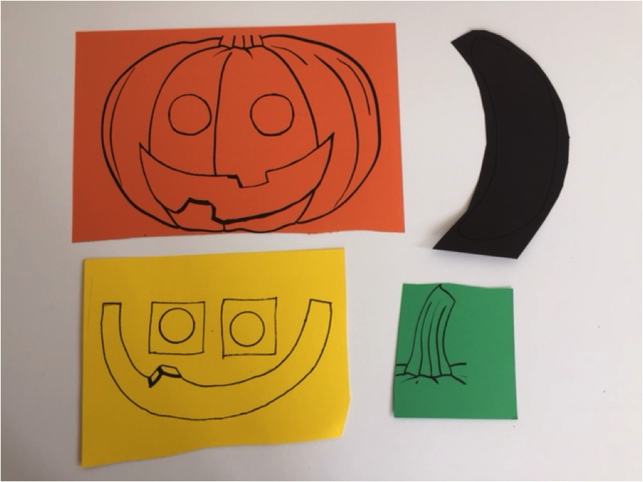

* pumpkin body printed on orange cardstock (60 lb)
* mouth and eye rims printed on yellow cardstock
* mouth background printed on black cardstock
* pumpkin stem printed on green cardstock

Templates for printing these pieces can be found on the [main Blinky Bot Page](https://wcrsyyc.github.io/diy-blinky-bot/).

### <a name="electronic_parts">⚓</a> Electronic Parts

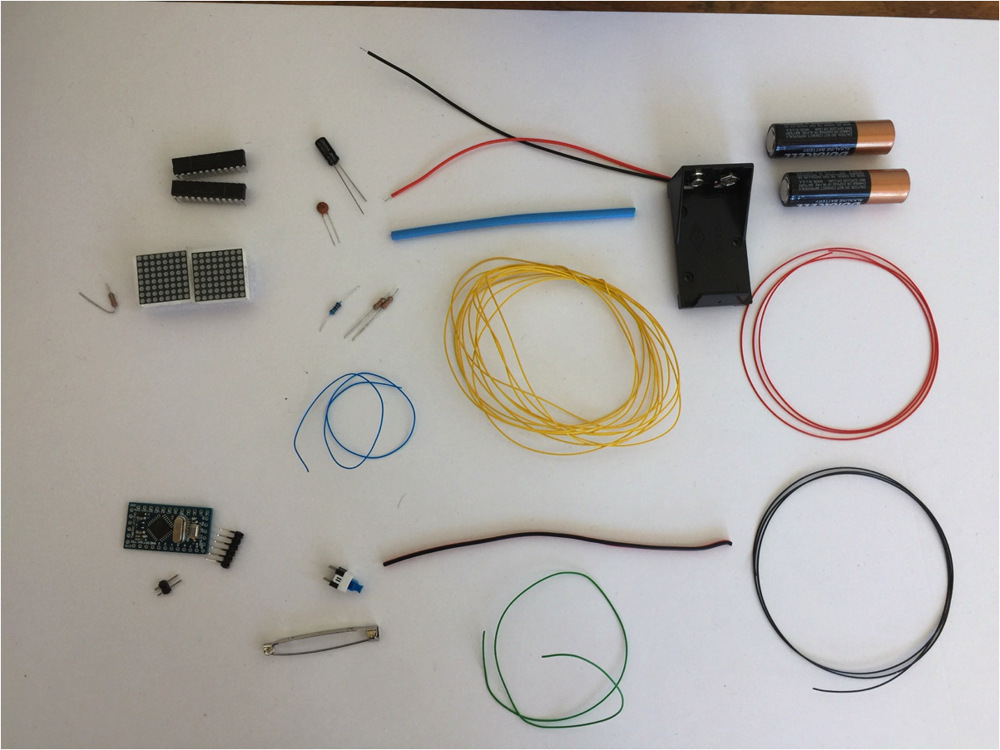

* 2 – MAX7219 display driver chips
* 2 – 8 x 8 led matrices (20mm x 20mm 788BS in this example)
* 2 – 32KΩ resistors
* 1 – 10KΩ resistor
* 1 – 10uF capacitor
* 2 – 0.1 mF capacitor
* 1 – 5V Arduino Pro Mini*
* 1 - 6 pin 90 degree header (for Arduino Pro Mini)
* 1 - 3 long breakable straight pin header (for Arduino Pro Mini)
* 1 – micro switch
* 1 – bar pin
* 3m - yellow wire-wrap wire (30 gauge)
* 70 cm - red wire-wrap wire (30 gauge)
* 70 cm - black wire-wrap wire (30 gauge)
* 30 cm - blue wire-wrap wire (30 gauge)
* 30 cm - green wire-wrap wire (30 gauge)
* 10 cm - 1/8" heat shrink tubing (shrinks to 1/16")
* 14 cm - dual strand wire (~22 gauge)
* 1 - 9V battery holder with connector wires
* 1 - 9V battery

NOTE:

*Make sure that you do not confuse a 5V Pro Mini with a 3.3V Pro Mini.

It is not necessary to have different colours of wire; it just makes the wiring more obvious.
****

### <a name="collect_tools">⚓</a> Collect the Tools

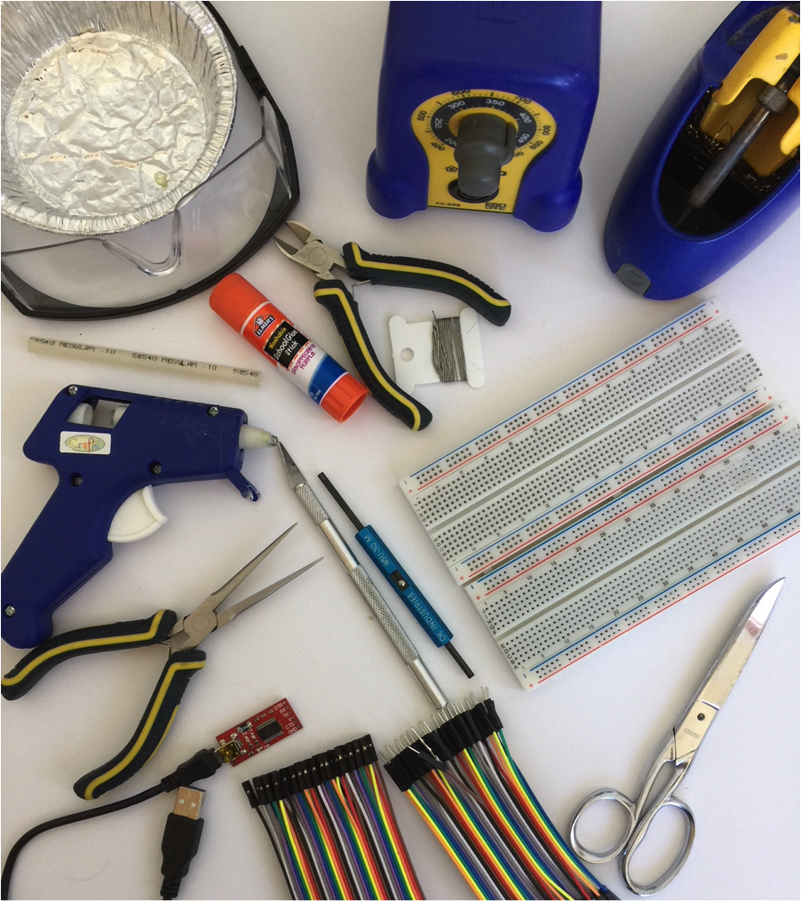

* safety glasses
* hot glue gun (with glue stick)
* white glue or glue stick
* scissors
* X-acto knife (optional)
* wire cutters
* wire-wrap tool
* soldering iron (with solder)
* needle nose pliers
* small container
* 1 or 2 - 830 point breadboards (5 1/2cm x 16 1/2cm)
* male-male jumper wires
* male-female jumper wires
* FTDI to USB converter (required to download the program to the Arduino Pro Mini)
* Arduino R3 Uno with USB connector cable (optional, not shown)*

\* Many people find it easier to initially write their program on an Arduino R3 Uno because it does not require the FTDI converter.  The much smaller Pro Mini is only required for the final product, when space and reduced weight are at a premium on the cardstock.  The example programs will work on most Arduino micro-controllers.
****

## <a name="getting_started">⚓</a> Getting Started

* Place the supplies into a small container to keep small parts from getting lost.

* Put the pumpkin cardstock pieces aside for the moment.

### <a name="circuit_breadboarding">⚓</a> Breadboard the Circuit

The circuit for the Pumpkin with Matrix Eyes is sufficiently complex that it is ***strongly*** recommended that you breadboard the circuit first.  Troubleshooting a circuit on a breadboard is much easier than trying to troubleshoot a circuit that has already been soldered and placed on cardstock.   Once you have the circuit working properly on the breadboard, you can then transfer it to the cardstock.

**Note:**  It is assumed at this point that you know how a breadboard works and how to read a circuit diagram.  If you need help with either of these skills, ask a WCRS mentor and/or review the information for a Level Two Blinky-bot.

* [Learn about the LED Matrix](about-matrix.md)

### <a name="matrix_to_arduino">⚓</a> Connecting the LED matrix to the Arduino

The MAX7219 IC used in this project is an efficient and inexpensive driver to control an 8x8 matrix. The schematic diagram to connect the Arduino to one driver and one matrix is shown below.  Again, it is recommended that you breadboard and test this circuit before transferring it to the cardstock pumpkin.

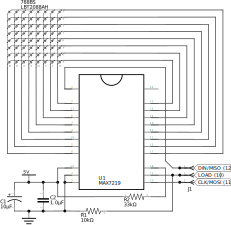

Note that this diagram is for a 788BS matrix.  As described on the [Learning about](about-matrix.md) page, the connections may have to be modified for other matrices.

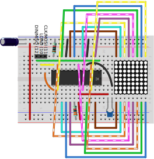

Building this circuit requires a lot of connections and can become quite messy on the breadboard.  It is a good idea to [test wires for conductivity](breadboard-wire-tester.md) before using them to breadboard your project.  Jumper wires are prone to bad connections at their pins.

It is also possible to purchase matrices already wired to a 7219 chip.  These matrices are typically larger than the small matrices used in this project.  However, the larger pre-wired models are ideal for installation in a pumpkin-sized model, such as Janyst used in his original version.

If you are new to programming or have not worked with LED matrices before, it is further recommended that you start with one matrix, rather than the two that are needed for the final project.

Once you have mastered some of the programming challenges presented in the next section, a second matrix, and driver, can be added as shown below.  This wiring diagram is very similar to the single matrix diagram, with the following adjustments: pin 24 of the first driver is connected to pin 1 of the second driver, and there is no 10KΩ resistor for the second driver.  The other connections that were going to the Arduino go to the first driver instead (and from there to the same pins on the Arduino).

Here is a schematic for the full Circuit, with both eyes, and the Arduino Pro Mini board.

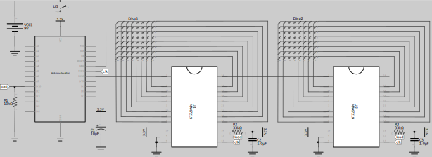

Here is one possible breadboard layout for the full matrix eyes circuit on a single breadboard.  These (and many other images here) were exported from a [Fritzing](https://fritzing.org) sketch.

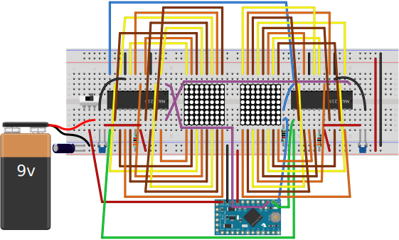
****

## [Programming](programming-matrix.md)

## [Assemble the Pumpkin](assemble-pumpkin.md)

## <a name="voila_done">⚓</a> Voila! You are done!

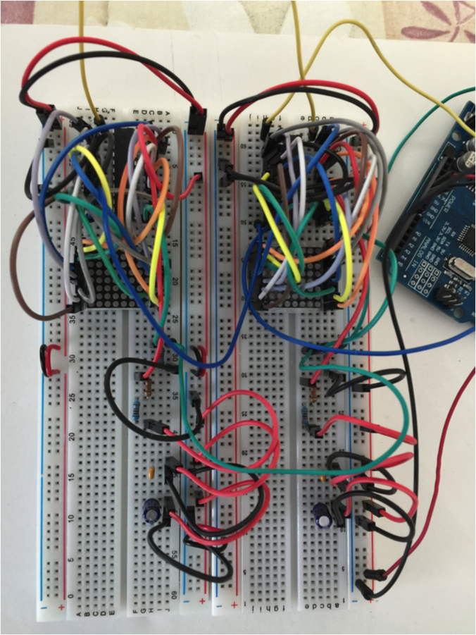
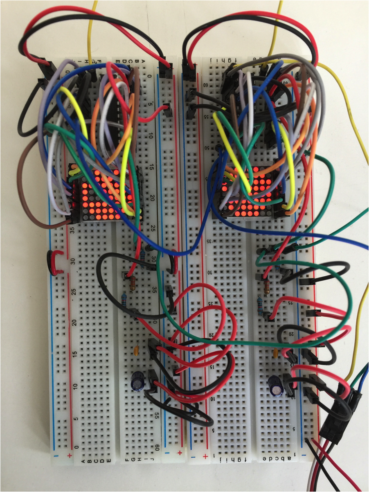
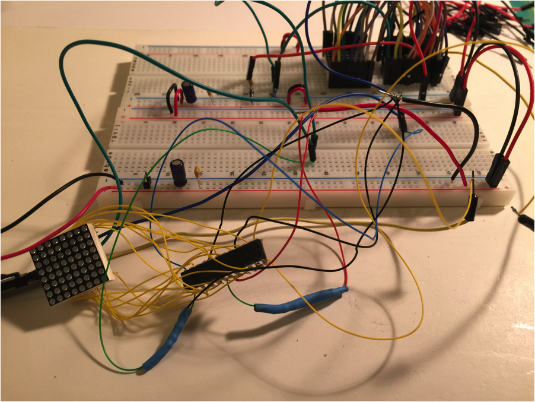
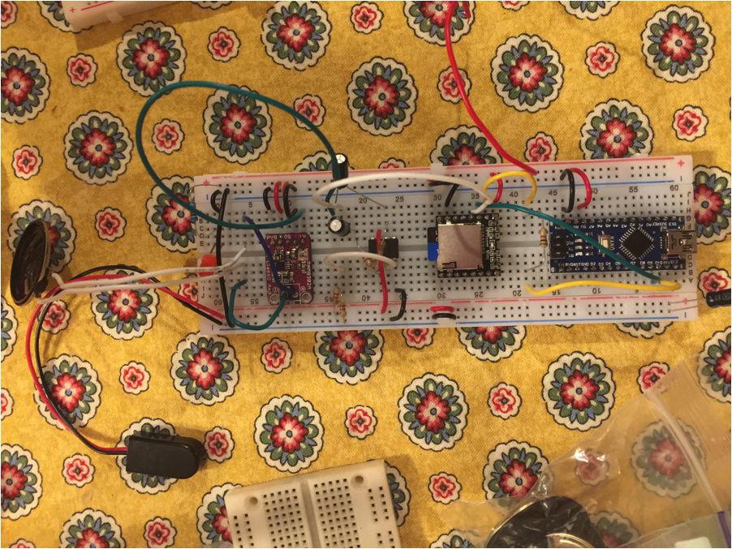
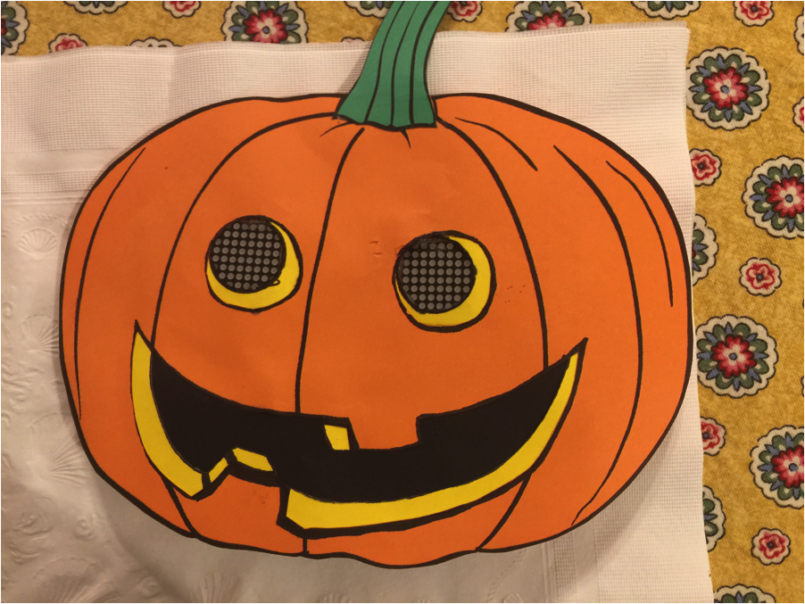

## [Appendix A - Example Code for Pumpkin](pumpkin-example-code.md)

## [Appendix B - Example Code for Learning Challenges](pumpkin-challenge-code.md)
