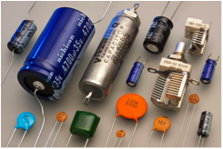
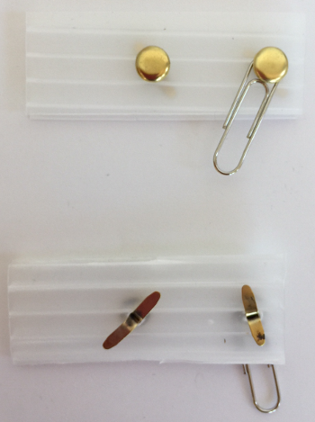

# 
<b>WITCH BLINKY-BOT INSTRUCTABLE</b>

---

## **Level Two Build**

# **WESTERN CANADIAN ROBOTICS SOCIETY**

## **Introduction**
The Witch Blinky-bot described in this instructable is a Level Two project.&nbsp; Completing a Level One Blinky-bot is a pre-requisite before attempting this project.&nbsp; You can expect to spend a minimum of two hours building this project.

The [electronic circuit](https://en.wikipedia.org/wiki/Electronic_circuit) for Level One Blinky-bots is quite simple, consisting of wires, a battery and some fast-blinking multi-coloured LEDs.&nbsp; The LEDs blink because of an internal circuit in the LEDs.&nbsp; For the Witch Blinky-bot described here (and for the comparable Frankenstein Blinky-bot), the circuit is more complicated, with three additional components -- resistors, capacitors and transistors.&nbsp; Two single-coloured LEDs blink in an alternating pattern, using a circuit known as an [astable multivibrator](https://en.wikipedia.org/wiki/Multivibrator).&nbsp; The Witch Blinky-bot uses two NPN transistors, while the Frankenstein Blinky-bot accomplishes the same task using two PNP transistors (more on this later).

The instructions presented in this booklet concentrate on assembly instructions.&nbsp; However, if you take the time, this project is a great opportunity to learn much more, such as:

* how to read an electronic circuit [schematic](https://en.wikipedia.org/wiki/Circuit_diagram)
* breadboarding skills
* what resistors, capacitors, diodes, and transistors do, and how they work
* how the value of the resistors and capacitors affect the blink rate
* how the same blinking pattern can be accomplished with at least three different circuits
* how to use an oscilloscope and the data it measures
* how to use a circuit simulator to design, investigate, and fine tune circuits

Obviously, a short booklet cannot cover all of these topics.&nbsp; However, links to other sources where you can learn about these topics are included throughout this instructable.&nbsp; By taking the time to go through these extra sections, you will learn valuable skills needed to design your own circuits.

## **Get the Supplies**

* 1 – witch face printed on light green card stock
* 1 – witch hat printed on black card stock
* 1 – hatband printed on orange card stock
* 1 – tongue printed on red card stock
* 1 – scrap piece of white card stock (6 cm x 2 cm)
* 1 – white card stock with 3 teeth
* 1 – scrap piece of black card stock (5 cm x 2 cm)
* 2 – pieces of scrap card stock (2 cm x 2 cm, any colour)
* 1 – piece of black yarn, 90 cm
* 1 – piece of fabric (1½ cm x 1½ cm)  
* 1 – 16 cm piece of black AWG 30
* 1 – 23 cm piece of red AWG 30
* 1 – 76 cm piece of yellow AWG 30 wire  
* 1 – coin cell battery holder
* 1 – 3V coin cell battery (CR 2032)
* 1 – paper clip
* 2 – brads (~ 1½ cm)
* 1 – 2 cm x 6 cm corrugated cardboard or plastic piece, with two holes punched 2½ cm apart
* 1 – bar pin  
* 2 – 5 mm red LEDs
* 2 - 100µF capacitors
* 2 – [BC547B](http://pdf1.alldatasheet.com/datasheet-pdf/view/50732/FAIRCHILD/BC547B.html) (or [2N3904](https://www.sparkfun.com/datasheets/Components/2N3904.pdf)) transistors or equivalent[[1]](#footnote1)
* 2 – 39 KΩ resistors
* 2 – 100Ω resistors

<a name="footnote1">[1]</a> Note that the pinout for different types of transistors is not always the same.&nbsp; See the schematic in the breadboarding section.

**Note:** A template for the witch parts can be found here: [Witch-template.pdf](Witch-template.pdf)

## **Assemble the Tools**

* safety glasses
* breadboard
* 5V/3.3 breadboard power supply (optional, but recommended)
* 9V power supply (optional, but recommended)
* solid core wire of multiple colours, stripped 3/4 cm on both ends (or male-male jumper wires)
* hot glue gun and glue stick
* white glue
* toothpick (as a glue applicator)
* straight pin
* scissors
* wire cutters
* needle nose pliers (optional, but helpful)
* [wirewrap](https://en.wikipedia.org/wiki/Wire_wrap) tool with stripper
* soldering iron and solder
* ruler
* circle template (optional, but helpful)
* red pen or fine marker
* yellow pencil or marker
* X-acto knife
* cutting board
* multimeter (important for troubleshooting)
* small container (to hold loose parts)

## **The Circuit**

The circuit used for the Witch Blinky-bot is known as an astable multivibrator.&nbsp; Two examples of an astable multivibrator circuit are shown below.&nbsp; The schematic on the left uses NPN transistors, whereas the schematic on the right uses PNP transistors.&nbsp; Both circuits produce the same result.&nbsp; The Witch Blinky-bot uses a circuit similar to the one on the left and the Frankenstein Blinky-bot uses a circuit similar to the one on the right.&nbsp; Note that there are many circuits to create an alternating blinking pattern with LEDs.&nbsp; (See the section on **[Getting the Most Out of This Project](#getting_the_most)**.&nbsp; Note that the values of components supplied with this kit are different than the example shown below.)

From: http://led-circuits.blogspot.ca/2011/02/2-transistor-led-flasher.html

| 
How to Read a Circuit Schematic
 |
| :--- |
||
| Simply stated, a schematic is a map, which shows how electronic components are connected between a power source and ground.&nbsp; This does not (necessarily) show where the components are placed, only how they are linked (by wires) together.&nbsp; To be able to build circuits, you will need to know the symbols for various electronic components.&nbsp; For this project, you will need to know the symbols for diodes, resistors, capacitors, transistors, batteries, and ground.&nbsp; (Note that LED’s are a type of diode, as LED stands for light emitting diode.)&nbsp; You also need to be careful of polarity when connecting your components.&nbsp; If a component has polarity, the positive end must be connected toward the power source and the negative end must be connected toward the ground.&nbsp; If a component does not have polarity, it may be connected in either direction.&nbsp; There are many sources to learn about circuit schematics.&nbsp; Here is one such source:  https://learn.sparkfun.com/tutorials/how-to-read-a-schematic |

| 
Resistors
 |
| :--- |
|  |
| A resistor restricts the flow of current, in much the same way that a water faucet restricts the flow of water.&nbsp; Resistors help channel current flow in the right direction and protect other components, such as LEDs, from receiving too much current.&nbsp; Resistance, voltage, and current are related according to Ohm’s Law.&nbsp; Learn about resistors and Ohm’s Law here:  https://www.youtube.com/watch?v=Gc1wVdbVI0E  Resistance is measured in ohms.&nbsp; If you have not already done so, now is a good time to learn about how to use a multimeter to measure resistance.  https://www.youtube.com/watch?v=TdUK6RPdIrA
|  |

| 
Capacitors
 |
| :--- |
|  |
| Capacitors store and discharge energy, much like a battery.&nbsp; The difference is that batteries store their energy in a chemical form, whereas capacitors store their energy in an electric field.&nbsp; Capacitance is measured in Farads.&nbsp; Larger capacitors have polarity, whereas smaller capacitors often do not.&nbsp; Here is one source to learn more about capacitors:  https://www.youtube.com/watch?v=0gZKik_BhQQ
|  |

| 
Diodes
 |
| :--- |
|  |
| A diode acts like a check valve; it allows current to flow in one direction and resists current flow in the other direction.&nbsp; Consequently, diodes have polarity.&nbsp; LEDs (light-emitting diodes) are just one of many types of diodes.&nbsp; The basis for a diode is a PN junction, which is also an important concept for transistors.&nbsp; To learn about PN junctions and diodes, check out:  https://www.youtube.com/watch?v=ar7xDMR4P_U |
|  |

| 
Transistors
 |
| :--- |
|  |
| A transistor can be used as a switch or as an amplifier.&nbsp; In the case of the Witch robot, the two transistors function as switches.&nbsp; (You can clearly see how the transistors function as switches if you do the simulator exercise.)&nbsp; When placing transistors in a circuit, make sure to carefully check the data sheet for the transistor to correctly identify the base, collector, and emitter legs.&nbsp; To learn more about transistors, check out the following sites:  https://www.youtube.com/watch?v=7ukDKVHnac4 http://www.explainthatstuff.com/howtransistorswork.html |
|  |
| Note: The transistors used and described here are [Bipolar Junction Transistors](https://en.wikipedia.org/wiki/Bipolar_junction_transistor) (BJT).&nbsp; There are other types of transistors as well. |

## **Breadboard the Circuit**

The circuit for the Witch Blinky-bot is sufficiently complicated that it is strongly recommended that you breadboard the circuit first.&nbsp; Troubleshooting a circuit on a breadboard is much easier than trying to troubleshoot a circuit that has already been soldered.&nbsp; Once you have the circuit working properly on the breadboard, you can then transfer it to the [card stock](https://en.wikipedia.org/wiki/Card_stock).

| 
How to Use a Breadboard
 |
| :-- |
|  |
| There are many Internet sources that explain breadboarding.&nbsp; Here is one such source:   https://www.youtube.com/watch?v=6WReFkfrUIk  It is important to understand how to supply power to a breadboard and which the rails (or rows) on a breadboard are common (connected).&nbsp; Note that, by convention, the red rail is connected to power and the blue/black rail is connected to ground. |

* Place the supplies into a small container to keep small parts from getting lost.

* Following the schematic below, construct the astable multivibrator circuit on a breadboard.

Note that LEDs have polarity.&nbsp; The long leg of the LED is positive, so it is connected to the power side.&nbsp; The short leg is negative, so it is connected toward the ground side.

Note that the capacitors also have polarity.&nbsp; Like the LEDs, the long leg is positive, so it is connected to the power side.&nbsp; The short leg is negative, so it is connected toward the ground.

All NPN transistors are represented by:

However, as shown below, the pinout (arrangement of the leads) depends on the transistor number.&nbsp; Two transistors types may be functionally identical, but the position of the base, emitter and collector legs is often different.&nbsp; So it important to be aware of which transistor you are using.&nbsp; Data sheets (readily available on the Internet) are a good source to verify the pinout.

Once you have completed the circuit on a breadboard and carefully checked it for errors:

* Set the breadboard power supply to 3.3V.

* Connect the 9V power supply to the breadboard power supply.
  * Alternatively, you can use the 3V coin cell as a power supply.&nbsp; However, if you do a significant amount of troubleshooting or experimentation, a battery may not last very long.

* The LEDs should blink in an alternating pattern.&nbsp; If they don’t, turn the power supply off and troubleshoot the circuit.&nbsp; A multimeter is useful to check connectivity.

## **Getting the Most Out of This Project**

With your circuit working and before you solder it into a finished product, now is a good time to experiment with it and to customize it to your own preferences.

Some questions that you might investigate are:

* How is the blinking rate affected by the value of the capacitors? &nbsp; For example, try substituting a 47µF capacitor for the 100µF capacitor.&nbsp; What happens if you have capacitors with two different values in your circuit?

* How does supply voltage affect the blinking rate?&nbsp; Try changing the voltage of the power supply from 3.3V to 5V.

* How is the blink rate affected by changing the colour of the LEDs?

* How is the blink rate affected by changing the resistance of the 39K resistor?

Here are some other activities to try:

* Get one of our mentors to help you hook up an oscilloscope to your circuit and measure the current flow through different parts of your circuit, especially through the LEDs and capacitors.

* Model the circuit in a circuit simulator, such as [LTSpice](http://www.linear.com/designtools/software/) or [CircuitLab](https://www.circuitlab.com/).&nbsp; How close does the blinking rate predicted by the model match your breadboard circuit.&nbsp; What factors might explain any differences?

* Build the same circuit with PNP transistors (the Frankenstein Blinky-bot).&nbsp; How do the two circuits compare?

* Build another version of this circuit with a 555 timer chip, such as described here:  http://www.learningaboutelectronics.com/Articles/LED-flasher-circuit.php.

## **Assembling the Witch Blinky-Bot**

* Cut out the face, hat, hatband, tongue, and teeth.

* Cut out the eye-holes and the mouth.&nbsp; (An X-acto knife and cutting board might help here.)

* Fray the edges of the fabric piece by pulling out some of the strands along the edges.

* Using white glue, glue the white piece of paper onto the back of the head, behind the eyes.

* Using a red pen or fine-tipped marker, draw in circles (~12 mm) for the irises.&nbsp; Colour the irises yellow.&nbsp; (A circle template may be helpful for this step.)

* Glue the teeth in from the backside of the face.

* Glue the tongue in from the backside of the face.

* Glue the black scrap piece of card stock behind the tongue to form the throat.

* Glue the fabric piece to the hat.

* There is a cut line across the hat.&nbsp; Note the small marked notches on the cutline.&nbsp; Cut along the line between the notches.&nbsp; Extend the cut ~1cm beyond the notches.&nbsp; Slide the face into the cut line.&nbsp; Glue in place.

* Slide five pieces of yarn into the hat slit on either side of the face.

* Cut two 2cm squares from scrap card stock.&nbsp; Hot glue the yarn in place on the backside of the hat.&nbsp; Press the two squares over the hot glue.&nbsp; Unravel the yarn, so that the plies are separated and crimped.

* Prepare the wire pieces.&nbsp; Cut the wire to length and then, using a wirewrap tool, strip the wire  cm on both ends.&nbsp; (Normally, a wirewrap tool comes with a stripper, which is designed to be used on AWG30 wire.&nbsp; Most other wire strippers cannot strip wire this small.)

 * 3 – 5cm pieces of black AWG30 wire
 * 1 – 3cm piece of red AWG30 wire
 * 2 – 5cm piece of red AWG30 wire
 * 1 – 9cm piece of red AWG30 wire
 * 1 – 4cm piece of yellow AWG30 wire
 * 2 – 5cm pieces of yellow AWG30 wire
 * 2 – 6cm pieces of yellow AWG30 wire
 * 1 – 7cm pieces of yellow AWG30 wire
 * 2 – 9cm pieces of yellow AWG30 wire
 * 2 – 12cm pieces of yellow AWG30 wire

* As a general comment, when inserting components from the front of the face and wiring from the back, make sure the component leads are as far through the face as desired.&nbsp; Furthermore, make sure that the wire connection is close to the card stock surface before soldering in place.

* Using a straight pin, punch two holes in each eye for the LEDs.&nbsp; Insert the LEDs.

* Using a straight pin, punch two holes for a 100Ω resistor at the end of the witch’s nose.&nbsp; Insert the resistor.&nbsp; (Needle nose pliers can be helpful at this point.&nbsp; When bending the resistor wires, do not hold the resistor body with the needle nose pliers, as this can crush the resistor body.&nbsp; Instead, hold the wire leads with the pliers and bend the wire a short distance away from the resistor to avoid breaking the resistor.)

* With the straight pin, make two more holes, so that the second 100Ω resistor lies across the first 100Ω resistor.

* Working from the backside, wirewrap the two positive leads of the LEDs together (long legs) with a 5cm red wire.&nbsp; Solder ONE connection.&nbsp; Trim the soldered lead to ½ cm.

* With a 5cm yellow wire, wirewrap the negative end of the LED for the right eye (long leg) to one end of the bottom 100Ω resistor.&nbsp; Solder in place.&nbsp; Trim both soldered leads to ½ cm.

* With a second 5cm yellow wire, wirewrap the negative end of the LED for the left eye to one end of the top 100Ω resistor.&nbsp; Solder in place.&nbsp; Trim both soldered leads to ½ cm.

* Working from the front, use the straight pin to make two holes for each of the two capacitors on the right side of the hatband.&nbsp; (If you look carefully, you should see two faint dots for each capacitor.)

* Bend the capacitor leads at a right angle to the surface of the capacitor and insert the capacitors, so that they stand off the surface near the leads by ~½ cm.&nbsp; The other end of the capacitors should be touching the hat surface.

* Working from the backside, wirewrap a 9cm yellow wire from the empty lead (unconnected leg) of the bottom resistor to the positive lead of the capacitor (long leg) sitting closest to the edge.&nbsp;

* Use another 9cm yellow wire to wirewrap the empty lead of the top resistor to the positive lead of the capacitor sitting closest to the centre.

* Solder and trim the two resistor leads, but not the capacitor leads.

* Working from the front, use the straight pin to make three holes for each of the two transistors in the middle of the spider legs on the left side of the hatband.&nbsp; Insert the transistors, with the round part facing toward the chin.&nbsp; The transistors should rest slightly off of the surface.

* Working from the backside, use a 6cm yellow wire to wirewrap the positive lead of the capacitor closest to the centre to the collector of the transistor nearest the edge.&nbsp; Check to make sure that the capacitors are positioned appropriately on the front side.&nbsp; Then solder and trim the positive leg of the capacitor to ½ cm.

* Use another 6cm yellow wire to wirewrap the positive lead of the capacitor nearest the edge to the collector of the transistor closest to the centre.&nbsp; Check to make sure that the capacitors are positioned appropriately on the front side.&nbsp; Then solder and trim the positive lead of the capacitor to ½ cm.

* Use a 4cm yellow wire to wirewrap the negative lead of the capacitor closest to the centre to the base of the transistor closest to the centre.&nbsp; Check to make sure that the capacitors are positioned appropriately on the front side.&nbsp; Then solder and trim the negative lead of the capacitor to ½ cm.

* Use a 7cm yellow wire to wirewrap the negative lead of the capacitor to the base of the transistor (each closest to the edge).&nbsp; Check to make sure that the capacitors are positioned appropriately on the front side, then solder and trim the negative lead of the capacitor to ½ cm.

* Wirewrap the emitters of the two transistors together with a 4cm black wire.

* Working from the front, use a straight pin to make two holes for a 39KΩ resistor in the witch’s chin.&nbsp; Insert the resistor.

* Punch two more holes, so that the second 39KΩ resistor lies across the first 39KΩ resistor.&nbsp; Insert the resistor.

* Working on the backside, wirewrap a lead from one resistor to a lead on the other with a 3cm red wire.&nbsp; (Because the red wire is so short, you may have to trim the two resistor leads in order to make this connection.)&nbsp; Solder ONE connection and trim that lead to ½ cm.

* Wirewrap a 9cm red wire from the unsoldered resistor lead (the one with a red wire) to the positive LED lead with a red wire.&nbsp; Solder the resistor lead and trim the resistor lead to ½ cm.&nbsp; Do not trim or solder the LED lead.

* With a 12cm yellow wire, wirewrap the empty lead of the bottom resistor to the base of one of the transistors.&nbsp; Solder the resistor lead and trim the resistor lead to ½ cm.

* With another 12cm yellow wire, wirewrap the empty lead of the top 39KΩ resistor to the base of the other transistor.&nbsp; Solder the resistor lead and trim the resistor lead to ½ cm.

* Construct the switch as shown below, using two brass brads, a paperclip, and the corrugated plastic piece.

* On the backside of the plastic piece, solder a 5cm cm black wire to each of the brads.

* Wirewrap the black wire from the middle of the switch to the negative (round) end of the battery holder.&nbsp; Wirewrap a 5cm red wire to the positive (square) end of the battery holder.&nbsp; Solder both battery holder connections.

* Wirewrap the red wire from the battery holder to the unsoldered long lead of the LEDs (already connected to a red wire, but not soldered).&nbsp; Solder in place.

* Wirewrap the unconnected black wire from the end of the switch to the unsoldered emitter of the transistors (already connected to a black wire, but not soldered).&nbsp; Solder in place.

* Install a battery, close the switch, and test to make sure that the circuit works.

* Once the circuit is verified to be working, hot glue the battery holder onto the long end of the top of the switch.

* Hot glue the switch onto the backside of the face.

* Hot glue the bar pin in place on the backside of the hat, near the top.

* Trim any protruding leads.&nbsp; At this point, the leads can be trimmed shorter than ¾cm.

* Check to see that the capacitor leads are secure.&nbsp; If they are sliding through the card stock, then pull them back out and secure them with hot glue on the backside.

* Hot glue four pairs of googly eyes onto the two capacitors and two transistors.&nbsp; (Hint: Squeeze a very small amount of hot glue onto the tip of a toothpick.&nbsp; Use the glue on the toothpick to pick up an eye from the backside.&nbsp; Maneuver the eye onto the capacitor/transistor.)&nbsp; Tilt the eyes up, so that they are visible when the witch face is vertical.

VOILA!&nbsp; You’re done!
  

