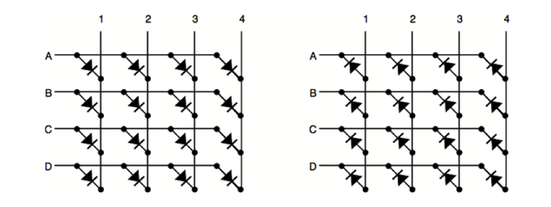
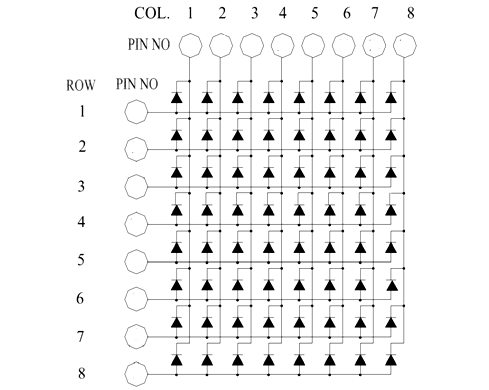
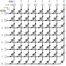
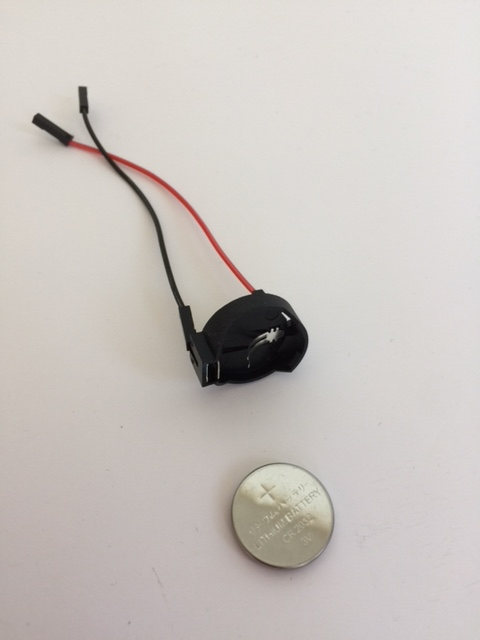
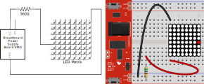
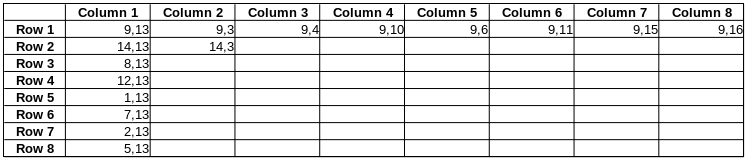

# [About the LED Matrix](Pumpkin.md)

<link href="css/markdown.css" rel="stylesheet"/>

* [How does it work](#how_matrix_works)
* [Which pin controls what](#pin_row_column)
* [Lighting up multiple LEDs at once](#multiple_at_once)

## <a name="how_matrix_works">⚓</a> How does it work

LED matrices may vary as to how they are wired, but they all work essentially the same.  The figure below shows two typical wiring configurations for an LED matrix.  In the first diagram, each led is lit by applying a path to power (HIGH) to its row letter and a path to ground (LOW) to its column number; this is known as common-row anode configuration . In the second diagram, each led is lit by applying a path to power to its column number (HIGH) and a path to ground (LOW) to its row number; this is known as a common-row cathode configuration. In practice, the distinction is not a big deal.

## <a name="pin_row_column">⚓</a> Which pin controls what

The convention for LED matrices is that the connections on the left (of the schematic symbol) indicate the direction of the rows; the columns are therefore perpendicular to the pins.  However, the pin numbers (typically numbered from the lower left corner counter-clockwise to the upper left-hand corner as viewed from the top of the LED matrix) do not correspond directly to the row and column numbers.  Furthermore, the correlation between pin numbers and row/column numbers varies for different models.  Therefore, it is often up to the user to figure out which pins correspond to which row/column numbers.  You might be able to google it and find a datasheet with the correlation on the internet, but even that can sometimes yield erroneous information.  Knowing how the pin numbers relate to the row and column numbers is essential to connect the matrix to the MAX7219 chip.

A pin schematic for a 788BS matrix (common-row anode) is shown below.  If you are using a 788BS matrix, you should still verify that these pin numbers light up the expected LEDs.  If you are using, a different matrix, then you may have to develop your own chart (see below).

### Identifying pin numbers for rows and columns

* Place the matrix across the middle groove in a breadboard.

* Make a tester from a 3.3V coin cell battery, a coin cell battery holder, and two male-female jumper wires. Alternatively, you can put a 3.3V or 5V power supply on the breadboard.  However, if you choose this second option, you must use a limiting resistor (typically in the range of 560 ohm).

* Assume that Pin 1 is the left-most pin from the label on the side of the matrix.  As viewed from the top of the matrix, pins 2-16 are then assigned in a counter-clockwise direction.  This is the convention for most 2 row 'IC chip' style components.

* Verify that the expected LED lights up when applying power to the row pin and ground to the column pin.
  * The content of the image below was exported from [Fritzing](https://fritzing.org/), then manually modified.

* If you are using an LED matrix which is different from a 788BS, and you cannot find a schematic or datasheet for it, you can develop your own.  Prepare an 8 X 8 table to record your data.  Label the rows 1-8 down the side.  Label the columns 1-8 across the top. Each data point will have two numbers associated with it -- one for the power pin and one for the ground pin.

* Connect the power to Pin 1.  Probe Pins 2-16 with the ground pin.  If an LED lights up, record the two pin numbers (power pin first, followed by ground pin) for the corresponding LED on the table.

* Repeat the process by connecting the power to Pin 2.   Probe Pins 1 and 3-16 with the ground pin.  Record the data for any pins that light up; record the power pin first (the anode) and the ground pin second (the cathode).  Keep moving the power pin through all the pins and probing with the ground on all the other pins not occupied by the power.

* There should be one and only one combination of pins that light up each led.  (Remember that LEDs have polarity, so the direction of current matters.)

* Soon, you should see a pattern emerging. Any given pin is only associated with one row or one column.  A partially completed table for a 788BS matrix is shown below.

## <a name="multiple_at_once">⚓</a> Lighting up multiple LEDs at once

From the previous exercise, it is clear how individual LEDs can be lit.  It is also easy to visualize how multiple LEDs in a given row or column can be activated -- just send power to the row and apply ground to the desired LED rows (common-row anode) or send power to the column and apply ground to the desired LED rows (common-row cathode).  The difficulty arises when trying to illuminate specific LEDs in different rows and columns at the same time, which, as it turns out, is actually impossible for a matrix, given the way that it is configured.  However, one can give the illusion of lighting up individual LEDs in different rows and columns by relying on a human phenomenon known as persistence of vision.

When sensors in the eye are stimulated the vision lingers for approximately a tenth of second. If the stimulus is renewed at high enough speed, the human brain merges the picture into a single vision.  This phenomenon accounts for why we see motion on TV and in films as smooth and continuous. In the case of an LED matrix, the rows (common-row anode) or columns (common-row cathode) are scanned or multiplexed at a sufficiently high rate that individual LEDs appear to be lit continuously. A demonstration of persistence of vision as applied to an LED matrix is shown in the video below.

[Arduino, LED matrix display. Illustration of the persistence of vision theory](https://www.youtube.com/watch?v=2y_9uLNTRbQ) youtube video

Those cool rotating projects (often clocks) that seem to write/draw in air also rely on persistence of vision.
