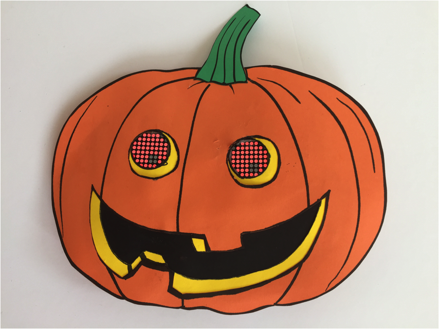

# [Assemble the Pumpkin](Pumpkin.md)

<link href="css/markdown.css" rel="stylesheet"/>

* [Cardstock pieces](#cardstock_pieces)
* [Transfer the Circuit](#circuit_transfer)
* [Assemble the Pro Mini Arduino](#assemble_pro_mini)

## <a name="cardstock_pieces">⚓</a> Cardstock pieces

* Cut out all the various cardstock pieces as shown in the following picture.  It is particularly important to cut the yellow eye holes neatly and accurately.

* Glue the yellow mouth pieces to the back of the pumpkin body as shown below.  Do **not** glue the yellow pieces to the back of the eyes yet.

* Glue the black piece to the back of the mouth.  Glue the stem on the top.

## <a name="circuit_transfer">⚓</a> Transfer the Circuit

There are multiple ways of laying out and wiring the driver chip to the LED matrix, the Arduino board, and the remaining components.  One version is described below.

NOTE: This section is still very rough and abbreviated.

* Cut 16 pieces of yellow wire, approximately 10 cm long.

* Strip each wire one cm on both ends.

* Working on **one LED matrix at a time**, replace the jumper wires between the 7219 driver chip and the LED matrix with wire-wrapped yellow wire.  Solder in place.

* Test the circuit to make sure it still works.
  * With the LED matrix and driver chip wired together, only 5 (or 6 for 2nd driver chip ground pin) wires need to be connected back to the breadboard to recreate the circuit that was there

* Repeat for the other matrix, testing afterwards that it still works.

* ground wires

* resistors (heat-shrink tubing)

* capacitors

* on/off microswitch

* 9V battery supply

* heavy gauge wire

## <a name="assemble_pro_mini">⚓</a> Assemble the Pro Mini Arduino

* Solder the 6 pin 90° header across the end of the Arduino Pro Mini.

* Using a FTDI connector, load the program into the Arduino Pro Mini.

* You only need 7 pins (other than the FTDI connector) on the Arduino Pro Mini
  * power, ground, and three digital pins to connect to the first MAX7219 display driver chip
  * vin and ground to connect to the battery and power switch.
    * the Pro Mini has 4 ground pins (solder pads) and 2 VCC (power) pins.  2 ground (GND) and one VCC connection are on the end with the right angle FTDI header.  Do **NOT** use these to connect to the rest of the circuit.  Leaving those alone makes reprogramming the pumpkin eyes later a lot easier.

The connection points for the wires in the above diagrams were chosen to minimize the number of connections directly to the Arduino Pro Mini, and the MAX7219 display driver chips.  Where practical, connection points have been move to the resistor and capacitor leads.  They should be easier to add multiple wire-wrap connections to, are less sensitive to soldering, and will not have any close neighbouring pins to get in the way.  The GND and VCC connections to the Arduino Pro Mini, for the MAX7219, are actually wire wrapped to the leads of the 10µF capacitor shown in the diagram for the wiring of power for the Arduino board.

* Transfer wires from the Uno Arduino to the Arduino Pro Mini.  Test the circuit to make sure it works before soldering the wires in place.

* Carefully glue the yellow eye circles onto the front of the LED matrices. Only the corner LED dots should be covered.

* With the program running, adjust the orientation of the eyes in the pumpkin eyeholes.  Mark the orientation by tracing around the outer perimeter of the yellow eye pieces on the back of the pumpkin.  Glue the yellow eye pieces in place.

* Lay out a position for the 9V battery holder on the back of the pumpkin, near the bottom.  The battery is relatively heavy and must be located low on the pumpkin.

* Lay out positions for the 7219 driver chips, the resistors, the capacitors, and the Arduino Pro Mini.

* After making sure that the program still works and that all wires will reach their intended position, hot glue the driver chips, the Arduino Pro Mini, the capacitors, and the resistors to the back of the pumpkin.

