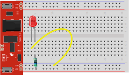

# Breadboard Wire Tester

<link href="css/markdown.css" rel="stylesheet"/>

Jumper wires used with breadboard vary considerably in quality. The are also prone to failure after repeated use.  The ends used to plug in to the breadboard can become detached from the actual wire, although the wire still looks goods.  When using a lot of jumper wires, it is a good idea to test the wires first.  Multimeter or continuity test can be used for this, but since these are probably going to be use on a breadboard anyway, here is a simple circuit to test a wire.  Replace the yellow wire with the one to be tested.  If the LED lights up, the wire is code.

The breadboard here is shown using a breadboard power supply board.  That can be replaced with power from an Arduino board, or batteries.  The test circuit will work fine with either 3 or 5 volts.  If using something like a 9 volt battery, the resistor should be replaced with something larger.  Something in the 1KΩ to 2.2KΩ range should be good.

The circuit is very small.  It can often be added to the end of the breadboard being used for the project, to quickly test (or retest) a wire that is suspected to not be working.  Of course, if jumper wires are being used to get power (and ground) to the breadboard, those wires have to be good as well.

