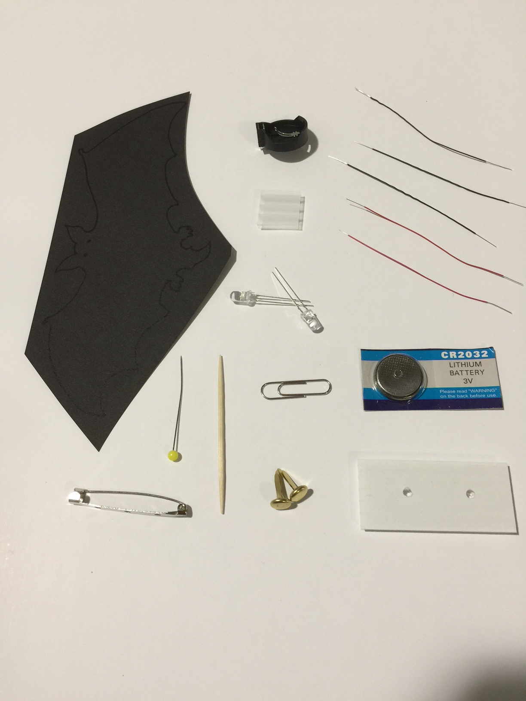
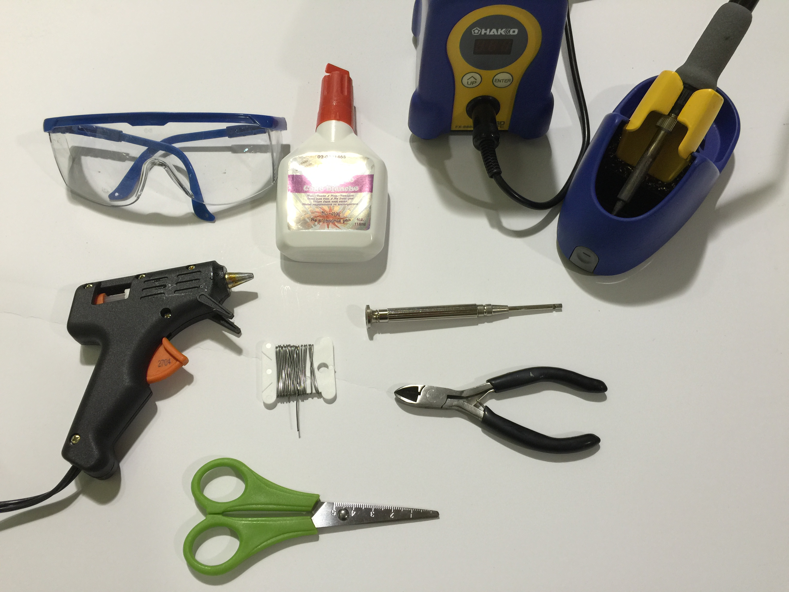
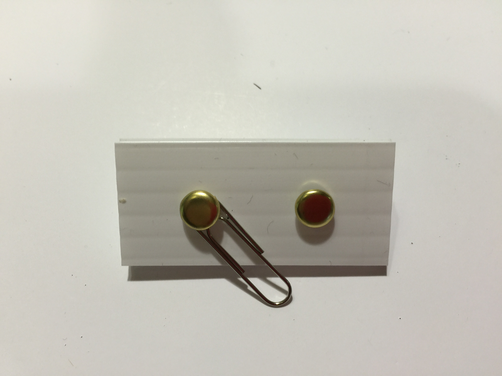
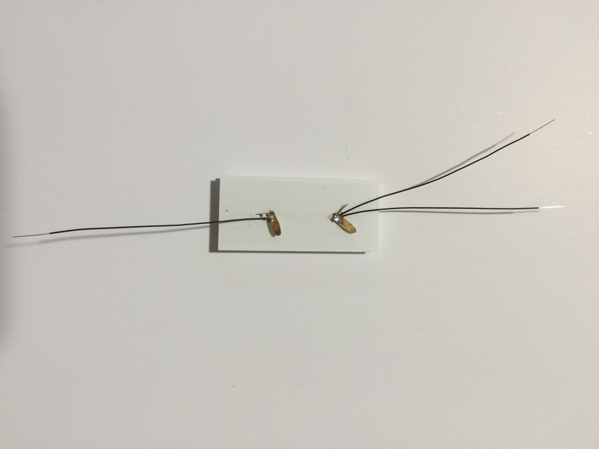
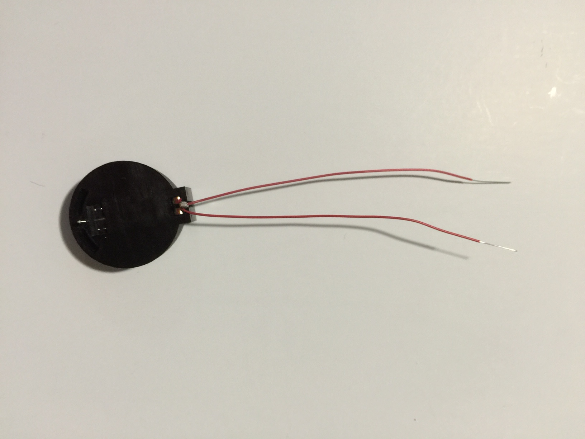
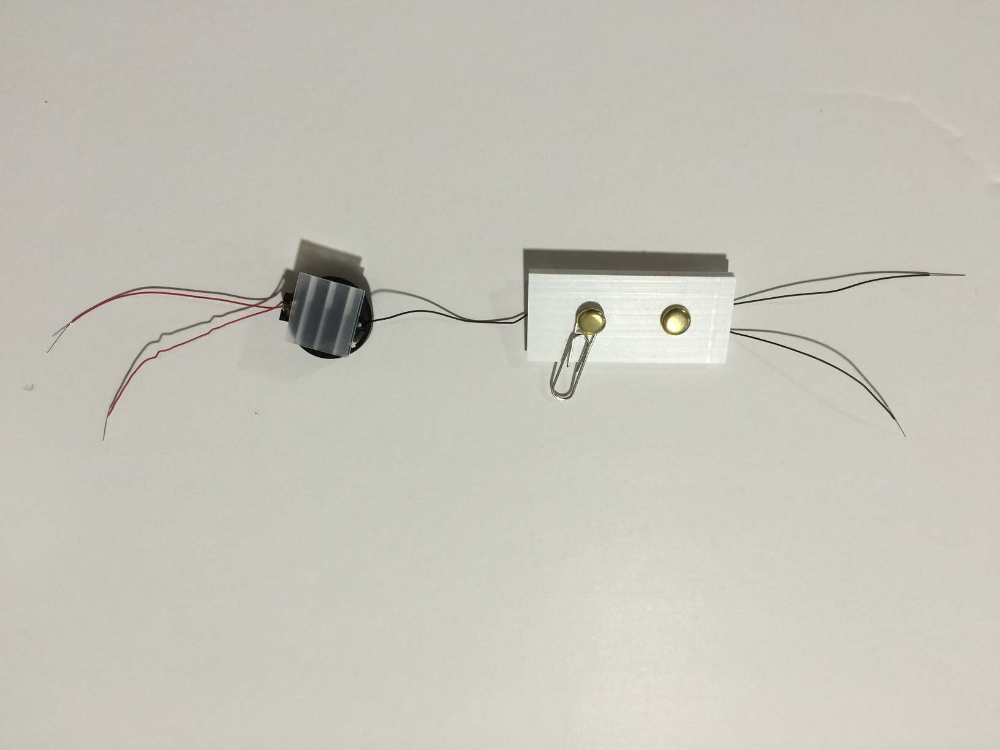

# Blinky Bot Circuit Assembly

## Get the supplies:

[Blink Bot kit supplies](pictures/bat_kit_parts.png)

  

## Collect the Tools:

## Build the Blinky Bot

1. Cut out and assemble the body of the Blinky Bot from the supplied card stock pieces

1. Using the straight pin, punch two holes in the body for each LED.  Look at an LED to see how far apart the holes should be.  One wire of the LED needs to go through each hole.

1. Insert the wire leads of the LEDs through the holes from the front side of the body.  Push the LEDs all of the way down to the body (all of the wire legs should be sticking out the back). 

1. Assemble the switch from the corrugated rectangle, the two brads, and the paperclip according to the above picture.
  * put one brad through the small end of the paper clip
  * put the brad through one of the holes in the rectangle
  * bend the legs of the brad over on the back to hold it in place.
  * put the other brad through the second hole in the rectangle, and bend the legs over on the back.

1. On the bottom of the switch, attach two black wires to one brad, and one black wire to the other bard.  Solder in place.
  * hold two of the black wires parallel, and twist the uninsulated (silver) ends at one end together.
    * three black wires for the Ladybug
  * bend a loop in the uninsulated (silver) part of the wire.  Slide the loop over one leg of a brad, and flatten is down on top of the leg.
  * Solder the wire to the leg of the brad.
  * do the same with the remaining black wire on one leg of the other brad.
  * Solder the wire to the leg of the brad.

  
1. Using the wire wrap tool, attach two (three for ladybug) red wires to the positive (larger) end of the battery holder.  Add the wires one at a time, on top of each other, then solder all of them one time only.

 
1. Using the wire wrap tool, attach the second end of the single black wire to the negative (smaller) post on the battery holder.  Solder in place.

 
1. Hot glue the back of the battery holder to the top of the switch assembly, across a corner furthest from the brads.

1. Using the wire wrap tool, attach each of red wires to the longest leg of an LED.  A different LED for each red wire.  Be sure to insert the LED leg all the way in the center tube of the wire wrap tool, so that the attached wire will wrap right against the body of the bot.

1. Using the wire wrap tool, attach each of the black wires to the shortest leg of an LED.  A different LED for each black wire.

1. Test the circuit before soldering.  Insert the battery in the holder with the positive (+) side up.  Close the switch.  All of the LEDs should blink.  Open the switch, remove the battery.
  * To remove the battery, squeeze the metal tab at the positive end.  Needle nose pliers can help with that, if fingers do not work.

1. Solder each of the previously wrapped wires on each leg of each LED.  Be careful not to solder the legs of an LED together.

1. Test the circuit again.

1. Hot glue the switch and battery holder assembly to the back of of the Blinky Bot.  Before gluing, figure out where you want to position it.  It is fine to glue it down on top of wires, but normally want to stay away from edges of the bot, so that it will not be visisble from the front.  The corners of the corrugated rectangle can be trimed, either before of after it is hot glued down, if that is needed.

1. While wearing the safety glasses (spectators too), trim the legs of the LEDs.  These can be shortened to just above where the black and red wires are soldered.  Just do not cut the black or red wires, and do not cut them off of the LED leg.  When cutting the LED wires, cut them one at a time, and hold on to the end of the wire being cut.  This prevents the cut end from being thrown, where it could hurt somebody.

1. Finishing touches. The remaining ends of the LEDs can be bent over flat to the body of the Blinky bot, so that the sharp ends do not stick up.  Just be careful not to bend the legs so that they touch each other, or the legs of the other LED.

1. Insert the battery in the holder a final time, close the switch, and verify that all of the LEDs blink.

Optional extra customization and decoration of your Blinky Bot.
