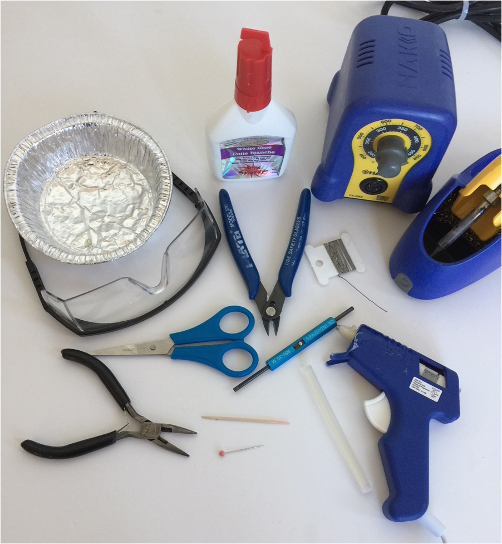
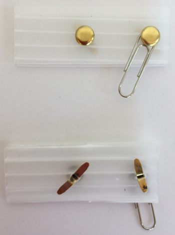
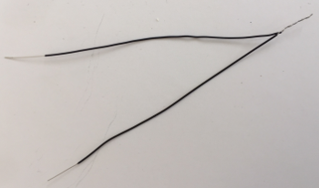
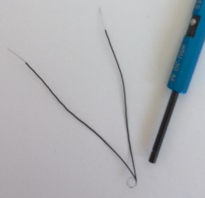
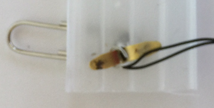
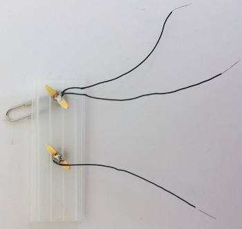
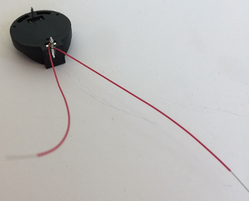
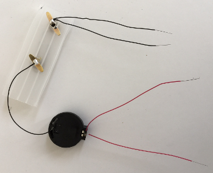

# Blinky Bot Circuit Assembly

# 
<b>«kit» BLINKY-BOT INSTRUCTABLE</b>

---

# **WESTERN CANADIAN ROBOTICS SOCIETY**

## **Get the Supplies**

* «n» — «kit specific» part information  
* 3 – 8 cm pieces of black AWG 30 wire (stripped ~1 cm on both ends)
* 2 – 8 cm pieces of red AWG 30 wire (stripped ~1 cm on both ends)
* 1 – coin cell battery holder
* 1 – 3V coin cell battery (CR 2032)
* 2 – fast blink multi-coloured LEDs
* 1 – paper clip
* 2 – brass brads (~1.25 cm)
* 1 – 2.5 cm x 7 cm corrugated cardboard or plastic piece, with 2 holes drilled/punched 2.5 cm apart closer to one end

**Note:** A template for the «kit» body can be found here: [«kit»-template.pdf](«kit»-template.pdf)

## **Assemble the Tools**

* safety glasses
* hot glue gun (with glue stick)
* white glue
* scissors
* wire cutters
* wire wrap tool
* soldering iron (with solder)
* needle nose pliers (optional)
* toothpick (glue applicator)
* straight pin
* small container

## **Getting Started**

* Place the supplies into a small container to keep small parts from getting lost.

* Cut out and assemble the body of the Blinky Bot from the supplied card stock pieces
* «kit» specific instructions to assemble the card stock body

## **Install the LEDs**

* Find the two LEDs and the straight pin. With the straight pin, punch **two holes in each** of the bat's eyes for the LEDs. Look at an LED and note how far apart the leads are; this is how far apart the two holes need to be. One lead of the LED needs to go through each hole.

* Install the LEDs through the holes. With a toothpick, place a small dab of glue under each LED (optional, but recommended for younger makers). Push the LEDs all the way down flat against the card stock. Turn the bat upside down and set aside to dry.

## **Assemble the Switch**

* Find the two brass brads, the corrugated rectangle, and the paperclip. Assemble the switch from these parts according to the picture below.

* Put one brad through one of the holes in the rectangle. Spread the wings on the other side to keep it in place.

* Put the other brad through the **small end** of the paper clip and install it through the other hole of the rectangle. Spread the wings on the other side.

* Find two black wires. Holding the two wires parallel with the stripped ends together, twist the stripped ends (the silver parts) together.

* Bend a loop in the twisted part of the wire. (**Hint:** Wrapping the wire around the tube of the wire-wrapping tool is a convenient way to form the loop.)

* Working on the backside of the switch, slide this loop around one of the wings of a brass brad and into the centre of the brass brad.

* Solder these wires to the centre of the brass brad. Let the solder cool for a few seconds and then test to make sure the solder job is secure by tugging gently on the wires.

* Find another black wire. Solder it to the other brass brad. Do this the same way that you just attached the first two wires, only this time you are only soldering a single wire. Test the wire to make sure it is soldered securely.

**Soldering Hints:** When soldering, remember to first preheat the soldering point with the soldering iron before bringing in the solder. Hold the soldering iron at a low angle to the soldering point to provide sufficient contact for good heat transfer. Keep the soldering iron in place when you bring the solder in to the soldering point. Always return the soldering iron to its holder; **never** lay a soldering iron down on a worktable.

## **Assemble the Battery Holder**

* Find the battery holder and two red wires. Turn the battery holder upside down so the pins are exposed.

* Using the wire wrap tool, attach **one** red wire to the **positive** pin (larger and square end) of the battery holder. Attach the second red wire to the **same** pin (positive).

* Solder the red wires in place. (Very little solder is required for soldering pins. Remember to preheat the pin before soldering.)

**Wire-wrapping Hints:** When loading the wire-wrapping tool, try to avoid bending and kinking the wire. Do not feed the insulated part of the wire into the tool. When spinning the tool, place a finger over the wire near the tool to keep the insulated part of the wire from being caught up in the wrapped wire. If the tool does not spin freely, it probably means that you have set the tool down on the outside hole, rather than the centre hole; lift the tool and try again.

## **Connect the Switch**

* Using the wire wrap tool, attach the **single** black wire from the switch to the **negative** pin (smaller, rounder end) of the battery holder. Solder in place.

## **Connect the LEDs**

* Note that the LEDs have a long lead and a short lead. The long lead is **positive** and the short lead is **negative**.

* Using the wire wrap tool, attach one red wire from the battery holder to each of the **positive** (long) LED leads. Make sure to push the wire wrap tool all the way down to the card stock before wrapping the wire, as the LED leads will be trimmed down later.

* Using the wire wrap tool, attach one of the two black wires from the switch to each of the **negative** (short) LED leads.

## **Test it out!**

* Put the battery into the battery holder with the **positive (+)** side up. (This often requires a fair bit of force, and it 'clicks' into place.)

* Close the switch. (Move the paper clip across the two brads.) Make sure that both of the LEDs are blinking. If not, you have some trouble-shooting to do (e.g., weak solder joints, backward wiring, wires bridging LED leads, upside down battery).

* Open the switch and remove the battery. To remove the battery, squeeze the metal tab on the top side of the battery, located at the positive end of the battery. (If finger pressure does not work, needle nose pliers may be needed.)

## **Solder the LED leads**

* Solder each of the four the LED leads. (Be careful not to bridge the leads with solder or you will create a short and the LED will not work.)

* Test the circuit and make sure that the LEDs are still working.

* **Put on safety glasses** and make sure anyone around you puts on safety glasses too.

* Using wire cutters, trim the LED leads **one at a time** to 0.5 cm. **Make sure you hold onto the LED lead so it does not go flying and hurt someone.** Also, be careful not to cut any wires.

## **Finishing**

* Put some hot glue on the top of the switch rectangle at the end away from the paperclip and brads. Press the bottom of the battery holder down into the glue. The pins of the battery holder will likely punch through the corrugated rectangle. Alternatively, you can position the battery holder so that one pin is past the side, and the other pin is past the end of the plastic piece (diagonal across a corner). Do not worry if glue gets on the wires.

* Put some hot glue on the bottom of the switch rectangle. Press the switch down onto «kit specific positioning information».

* Find the bar pin. Run a short bead of hot glue along the «kit specific positioning information». Carefully press the bar pin into the hot glue. (This pin is for pinning the bat onto clothing or a lanyard.)

* Test the circuit one last time.

* VOILA! You are done!

**Note:** The switch can be closed more securely by sliding the paperclip under the edge of the brass brad.

******************

IDEA:
* to get the images in place in the nested lists, attach them to previous list element with "  ", without any EOL characters
  * previous text  
* that *might* prevent the restarting of the outer numbering sequence, while keeping the image close to where it is want.  Just with a bit of indent for the nest level.

## Build the Blinky Bot

1. Cut out and assemble the body of the Blinky Bot from the supplied card stock pieces

1. Using the straight pin, punch two holes in the body for each LED.  Look at an LED to see how far apart the holes should be.  One wire of the LED needs to go through each hole.

1. Insert the wire leads of the LEDs through the holes from the front side of the body.  Push the LEDs all of the way down to the body (all of the wire legs should be sticking out the back).

1. Assemble the switch from the corrugated rectangle, the two brads, and the paperclip according to the above picture.
  * put one brad through the small end of the paper clip
  * put the brad through one of the holes in the rectangle
  * bend the legs of the brad over on the back to hold it in place.
  * put the other brad through the second hole in the rectangle, and bend the legs over on the back.

1. On the bottom of the switch, attach two black wires to one brad, and one black wire to the other bard.  Solder in place.
  * hold two of the black wires parallel, and twist the uninsulated (silver) ends at one end together.
    * three black wires for the Ladybug
  * bend a loop in the uninsulated (silver) part of the wire.  Slide the loop over one leg of a brad, and flatten is down on top of the leg.
  * Solder the wire to the leg of the brad.
  * do the same with the remaining black wire on one leg of the other brad.
  * Solder the wire to the leg of the brad.

1. Using the wire wrap tool, attach two (three for ladybug) red wires to the positive (larger) end of the battery holder.  Add the wires one at a time, on top of each other, then solder all of them one time only.

 
1. Using the wire wrap tool, attach the second end of the single black wire to the negative (smaller) post on the battery holder.  Solder in place.

1. Hot glue the back of the battery holder to the top of the switch assembly, across a corner furthest from the brads.

1. Using the wire wrap tool, attach each red wire to the longest leg of an LED.  A different LED for each red wire.  Be sure to insert the LED leg all the way in the centre tube of the wire wrap tool, so that the attached wire will wrap right against the body of the bot.

1. Using the wire wrap tool, attach each of the black wires to the shortest leg of an LED.  A different LED for each black wire.

1. Test the circuit before soldering.  Insert the battery in the holder with the positive (+) side up.  Close the switch.  All of the LEDs should blink.  Open the switch, remove the battery.
  * To remove the battery, squeeze the metal tab at the positive end.  Needle nose pliers can help with that, if fingers do not work.

1. Solder each of the previously wrapped wires on each leg of each LED.  Be careful not to solder the legs of an LED together.

1. Test the circuit again.

1. Hot glue the switch and battery holder assembly to the back of of the Blinky Bot.  Before gluing, figure out where you want to position it.  It is fine to glue it down on top of wires, but normally want to stay away from edges of the bot, so that it will not be visible from the front.  The corners of the corrugated rectangle can be trimmed, either before of after it is hot glued down, if that is needed.

1. While wearing the safety glasses (spectators too), trim the legs of the LEDs.  These can be shortened to just above where the black and red wires are soldered.  Just do not cut the black or red wires, and do not cut them off of the LED leg.  When cutting the LED wires, cut them one at a time, and hold on to the end of the wire being cut.  This prevents the cut end from being thrown, where it could hurt somebody.

1. Finishing touches. The remaining ends of the LEDs can be bent over flat to the body of the Blinky bot, so that the sharp ends do not stick up.  Just be careful not to bend the legs so that they touch each other, or the legs of the other LED.

1. Insert the battery in the holder a final time, close the switch, and verify that all of the LEDs blink.

Optional extra customization and decoration of your Blinky Bot.
