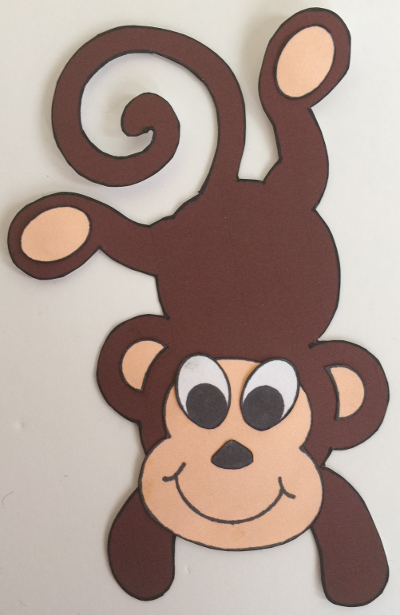
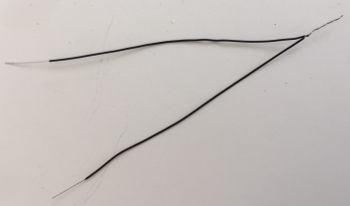
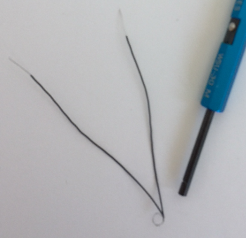
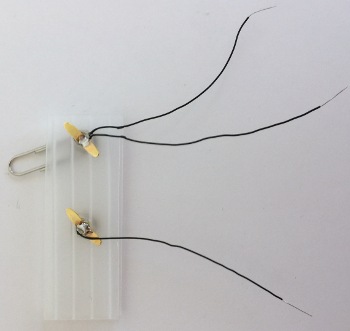
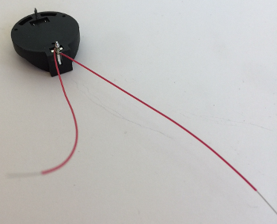
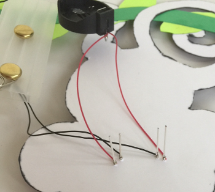

# 
<b>MONKEY BLINKY-BOT INSTRUCTABLE</b>

---

# **WESTERN CANADIAN ROBOTICS SOCIETY**

## **Get the Supplies**

* 1 – piece of brown card stock with printed monkey body
* 1 – piece of light peach card stock with printed face, feet pads and ear liners
* 1 – piece of white card stock with printed eyes and nose
* 1 – piece of light green card stock with five printed leaves
* 1 – piece of dark green card stock with printed tree branch
* 1 – bar pin  
* 3 – 8 cm pieces of black AWG 30 wire (stripped ~1 cm on both ends)
* 2 – 8 cm pieces of red AWG 30 wire (stripped ~1 cm on both ends)
* 1 – coin cell battery holder
* 1 – 3V coin cell battery (CR 2032)
* 2 – fast blink multi-coloured LEDs
* 1 – paper clip
* 2 – brass brads (~1.25 cm)
* 1 – 2.5 cm x 7 cm corrugated cardboard or plastic piece, with 2 holes drilled/punched 2.5 cm apart closer to one end

**Note:** A template for the monkey pieces can be found here: [Monkey-template.pdf](Monkey-template.pdf)

If you don’t have the appropriate colours of card stock, you can print the colours by changing the background colour of the sheet.

## **Assemble the Tools**

* safety glasses
* hot glue gun (with glue stick)
* white glue or glue stick
* scissors
* wire cutters
* wire wrap tool
* soldering iron (with solder)
* needle nose pliers (optional)
* toothpick (glue applicator)
* straight pin
* small container

## **Getting Started**

* Place the supplies into a small container to keep small parts from getting lost.

* Cut out the monkey body parts — body, face, feet pads, ear liners, eyes, and nose.

* Using the toothpick as a glue applicator, glue the face, the feet pads, and the ear liners onto the monkey.

* Glue the eyes and nose onto the face.

* Cut out the leaves and the tree branch.  Thread the tree branch behind the monkey’s foot and through the tail, as shown in the picture below.

* Glue the leaves on the tree branch.

* Glue the monkey onto the tree branch.

## **Install the LEDs**

*	Find the two LEDs and the straight pin. With the straight pin, punch **two holes in each** of the monkey’s eyes for the LEDs. Look at an LED and note how far apart the leads are; this is how far apart the two holes need to be. One lead of the LED needs to go through each hole.

* Install the LEDs through the holes. With a toothpick, place a small dab of glue under each LED (optional, but recommended for younger makers). Push the LEDs all the way down flat against the card stock. Turn the monkey upside down and set aside.

## **Assemble the Switch**

* Find the two brass brads, the corrugated rectangle, and the paperclip. Assemble the switch from these parts according to the picture below.

* Put one brad through one of the holes in the rectangle. Spread the wings on the other side to keep it in place.

* Put the other brad through the **small end** of the paper clip and install it through the other hole of the rectangle. Spread the wings on the other side.

* Find two black wires. Holding the two wires parallel with the stripped ends together, twist the stripped ends (the silver parts) together.

* Bend a loop in the twisted part of the wire. (**Hint:** Wrapping the wire around the tube of the wire-wrapping tool is a convenient way to form the loop.)

* Working on the backside of the switch, slide this loop around one of the wings of the brass brad and into the centre of the brass brad.

* Solder these wires to the centre of the brass brad. Let the solder cool for a few seconds and then test to make sure the solder job is secure by tugging gently on the wires.

* Find another black wire. Solder it to the other brass brad, in the same way that you just attached the first two wires, only this time you are only soldering a single wire. Test the wire to make sure it is soldered securely.

**Soldering Hints:** When soldering, remember to first preheat the soldering point with the soldering iron before bringing in the solder. Hold the soldering iron at a low angle to the soldering point to provide sufficient contact for good heat transfer. Keep the soldering iron in place when you bring the solder in to the soldering point. Always return the soldering iron to its holder; **never** lay a soldering iron down on a worktable.

## **Assemble the Battery Holder**

* Find the battery holder and two red wires. Turn the battery holder upside down so the pins are exposed.

* Using the wire wrap tool, attach **one** of the red wires to the **positive** pin (larger and square end) of the battery holder. Attach the second red wire to the **same** pin (positive).

* Solder the red wires in place. (Very little solder is required for soldering pins. Remember to preheat the pin before soldering.)

**Wire-wrapping Hints:** When loading the wire-wrapping tool, try to avoid bending and kinking the wire. Do not feed the insulated part of the wire into the tool. When spinning the tool, place a finger over the wire near the tool to keep the insulated part of the wire from being caught up in the wrapped wire. If the tool does not spin freely, it probably means that you have set the tool down on the outside hole, rather than the centre hole; lift the tool and try again.

## **Connect the Switch**

* Using the wire wrap tool, attach the **single** black wire from the switch to the **negative** pin (smaller, rounder end) of the battery holder. Solder in place.

## **Connect the LEDs**

* Note that the LEDs have a long lead and a short lead. The long lead is **positive** and the short lead is **negative**.

* Using the wire wrap tool, attach one red wire from the battery holder to each of the **positive** (long) LED leads. Make sure to push the wire wrap tool all the way down to the card stock before wrapping the wire, as the LED leads will be trimmed down later.

* Using the wire wrap tool, attach one of the two black wires from the switch to each of the **negative** (short) LED leads.

## **Test it out!**

* Put the battery into the battery holder with the **positive (+)** side up. (This often requires a fair bit of force, and it 'clicks' into place.)

* Close the switch. (Move the paper clip across the two brads.) Make sure that both of the LEDs are blinking. If not, you have some trouble-shooting to do (e.g., weak solder joints, backward wiring, wires bridging LED leads, upside down battery).

* Open the switch and remove the battery. To remove the battery, squeeze the metal tab on the top side of the battery, located at the positive end of the battery. (If finger pressure does not work, needle nose pliers may be needed.)

## **Solder the LED leads**

* Solder each of the four the LED leads. (Be careful not to bridge the leads with solder or you will create a short and the LED will not work.)

* Test the circuit and make sure that the LEDs are still working.

* **Put on safety glasses** and make sure anyone around you puts on safety glasses too.

* Using wire cutters, trim the LED leads **one at a time** to 0.5 cm. **Make sure you hold onto the LED lead so it does not go flying and hurt someone.** Also, be careful not to cut any wires.

## **Finishing**

* Put some hot glue on the top of the switch rectangle at the end away from the paperclip and brads. Press the bottom of the battery holder down into the glue. The pins of the battery holder will likely punch through the corrugated rectangle. Alternatively, you can position the battery holder so that one pin is past the side, and the other pin is past the end of the plastic piece (diagonal across a corner). Do not worry if glue gets on the wires.

* Put some hot glue on the bottom of the switch rectangle.  Press the switch down onto the middle of the back of the monkey.

* Find the bar pin.  Run a short bead of hot glue along the middle of the back of the branch.  Carefully press the bar pin into the hot glue.  (This pin is for pinning the monkey onto clothing or a lanyard.)

* Test the circuit one last time.

* VOILA! You are done!

**Note:** The switch can be closed more securely by sliding the paperclip under the edge of the brass brad.

